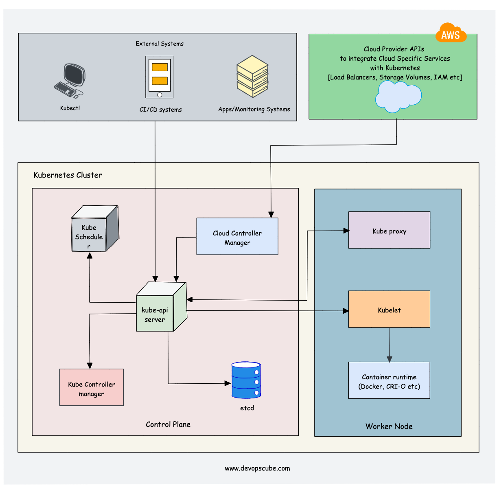

# Kubernetes

## What is Kubernetes?
 Kubernetes is an open-source platform that enables you to deploy and manage applications in a scalable way. It's a container orchestration system that allows you to automate the deployment, scaling, and management of containerized applications. With Kubernetes, you can easily create, deploy, and manage distributed applications in any environment.

 Kubernetes is designed to provide an easy and efficient way to deploy, manage, and scale containerized applications. It provides a platform for deploying and managing applications in a distributed and fault-tolerant manner. Kubernetes makes use of containers, which are isolated and self-contained units that can be run on any platform. Kubernetes also provides various tools and services for building, deploying, and managing applications.

 Kubernetes was originally developed by Google and is now maintained by the Cloud Native Computing Foundation. It's an open-source project that is supported by a large community of users and developers.

## Why we use kubernetes?

   Kubernetes is used for scaling, deploying, and managing containerized applications and services across different platforms, environments, and operating systems. It saves developers and operators time and effort, and keeps applications running well, at scale, despite challenges. It is an open-source, portable, and extensible platform that uses declarative configurations and automation. It is a standard for container orchestration and virtualization management software.

   Kubernetes provides a way to schedule and deploy those containers—plus scale them to your desired state and manage their lifecycles. Use Kubernetes to implement your container-based applications in a portable, scalable and extensible way.

    Kubernetes enables cloud managers to manage their cloud better. It can abstract networks, storage and even machines from their physical implementation, and give true automation to the administration. In short, you get a single interface where you can manage virtual machines, their physical states and even different types of clouds.

    Kubernetes services provide load balancing and simplify container management on multiple hosts. They make it easy for an enterprise’s apps to have greater scalability and be flexible, portable and more productive

## Features of kubernetes?
    Kubernetes provides an easy-to-use platform for deploying, managing, and scaling containerized applications.
    
     It simplifies the process of deploying and managing applications in a distributed environment.

     Kubernetes is designed to be fault-tolerant and resilient.

     It offers a range of tools and services for building, deploying, and managing applications.

     Kubernetes makes it easy to scale applications quickly and efficiently.

     It provides a platform for continuous integration and delivery (CI/CD).

     Kubernetes is open-source and free to use.

   

## Kubernetes Architecture?

   Kubernetes when started gives something called a cluster which consists of control plane and worker nodes. These worker nodes are the ones that run containerized applications. Every cluster has at least one worker node.

   Control Plane Components:

   API server:
       When a person need to install a brand new utility in a Kubernetes cluster the person interacts with the API server with the help of a client. All the communication occurs through it. Kubectl talks to the API server to carry out any operations.

   Scheduler:
       You send the API server a request to schedule a brand new pod, the API server after it validates your request will hand it over to the scheduler. Scheduler instead of randomly assigning it to any node first looks at how many resources application requires and according to that assigns it.

   Control Manager:
       It detects crashing of pods. So while pods die controller manager detects that and attempts to get better the cluster state as quickly as possible and for that it makes a request for the scheduler to reschedule the restart of that pod.
    
    etcd:
      etcd which is a key value store of a cluster state. It is a like the brain of the cluster. Every change in the cluster gets saved or updated into this key value store of etcd. The scheduler gets the information like what resources are available on each worker node and the controller manager knows that a cluster state changed in some way through etcd.
   
   Components of the Worker Node:

   Kubelet:
        It runs on each node in the cluster. It's number one goal is that it looks at the specification of the pods entered into the API server and makes sure that the containers described in that pod specification are running and healthy. It restarts the pod if any issue is noticed by it.

    Kube-Proxy:
        It is a network proxy that runs on each node in your cluster. It maintains the entire communication through networking. If worker node or cluster wants to communicate with outside network it makes sure to provide a communication medium. It also provides every worker node to have its own unique IP address.
     
     Container Runtime:
         It is responsible for running containers. A container runtime is required on every node in your cluster. Without it, pods in Kubernetes are non-existent.

     Kubernetes DNS:
          Kubernetes has its own internal DNS service. Every cluster has its own IP address and K8's DNS makes sure communication between different pods in separate cluster is possible.

## Pod Lifecycle

     The lifecycle of a Pod in Kubernetes consists of several phases, starting from the creation of the Pod until its termination. Understanding the Pod lifecycle is crucial for managing and troubleshooting applications running in Kubernetes. Here are the main phases of the Pod lifecycle:

     Pending:
       The Pod has been created, but the necessary resources (CPU, memory, etc.) have not been allocated on a worker node yet.
       The Pod remains in the Pending phase until all of its resource requirements are met, and the necessary node is available.

     Running:
       The Pod has been scheduled to a worker node, and all of its containers have been created and started.
       At this stage, the containers within the Pod are running and actively processing requests.   
    
     Succeeded:
        All containers in the Pod have completed their execution successfully and have exited.
        The Pod will remain in the Succeeded phase until it is manually deleted or terminated by a policy.

      Failed:
        One or more containers in the Pod have terminated unsuccessfully (exited with a non-zero status code).
        The Pod will remain in the Failed phase until it is manually deleted or terminated by a policy.  
    
     Unknown:
        The state of the Pod cannot be determined, typically due to an error in communication between the Kubernetes control plane and the node where the Pod is running.
        The Unknown phase is considered a transient state and should resolve once the communication issue is resolved
## Objects:
- Pod - Smallest unit of kubernetes. Its just wrapping around the container
- Service - Expose application 
    - ClusterIP - Expose application inside the cluster
    - NodePort - Expose application outside the cluster
    - LoadBalancer - Expose application outside the cluster 
- Namespace -  To segregate the resources / k8s objects

